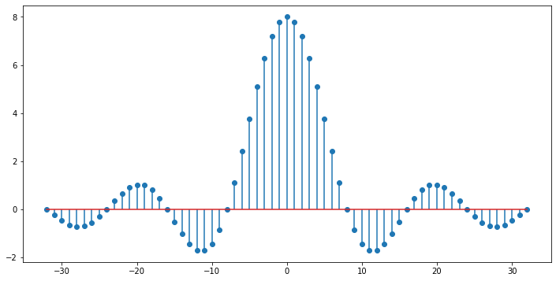

.. -*- coding: utf-8 -*-

.. _rcs_subversion:

Clase 02 - PIII 2025
====================
(Fecha: 11 de agosto)

Objetivos
---------
- Comprender y aplicar el concepto de **módulos** y **paquetes** en Python.
- Graficar señales en el dominio del tiempo y realizar operaciones sobre ellas.
- Manipular secuencias con condiciones y comprensión de listas.
- Repasar estructuras de control: ``if``, ``for``, ``while``.
- Generar y reproducir señales de audio en Python.
- Publicar el trabajo final en GitHub.

Requisitos
----------
- Python instalado o Google Colab listo.
- Paquetes: ``numpy``, ``matplotlib``.

Material inicial
----------------
Cree el repo ``curso-piii`` (si aún no lo hizo) y agregue una carpeta con el número de la clase ``clase<N>`` con:
- ``clase<N>.ipynb`` o ``clase<N>.py``.

--------------------------
Módulos y paquetes
--------------------------

**Módulo**: archivo Python con funciones, clases u otros recursos reutilizables.

Ejemplo: ``matematicas.py``

.. code-block:: python

    def sumar(a, b):
        return a + b

    def restar(a, b):
        return a - b

Uso desde otro archivo:

.. code-block:: python

    import matematicas
    print(matematicas.sumar(7, 5))
    print(matematicas.restar(17, 15))

Importar sólo lo necesario:

.. code-block:: python

    from matematicas import sumar
    print(sumar(7, 5))

**Paquete**: carpeta con varios módulos y un archivo ``__init__.py``

.. code-block:: bash

    operaciones/
        |-- __init__.py
        |-- matematicas.py
        |-- matrices.py

Importación desde paquetes:

.. code-block:: python

    import operaciones.matematicas
    from operaciones import matematicas
    from operaciones.matematicas import sumar

Ejercicio
~~~~~~~~~
- Crear un módulo que grafique una portadora sinusoidal y otra que la module en amplitud.

--------------------------
Manipulación de secuencias
--------------------------

Ejercicio
~~~~~~~~~
- Dada ``y = np.cos(n)``, mostrar los primeros 50 valores, reemplazando con 0 los negativos.

.. code-block:: python

    y = [2, 3, 4, 5, 6, 7]
    r = [0, 0, 1, 1, 0, 1]
    res = np.array([0 if r[i] == 0 else a for i, a in enumerate(y)])
    # => [0, 0, 4, 5, 0, 7]

- Graficar una secuencia senoidal con 12 muestras por ciclo.

--------------------------
Ejemplo de gráficos
--------------------------

.. code-block:: python

    import numpy as np
    import matplotlib.pyplot as plt

    x1 = np.linspace(1, 12, 12)
    x2 = x1 + 2
    fig, axs = plt.subplots(2, 2)

    axs[0, 0].plot(x1, x2)
    axs[0, 1].plot(x1, x2, 'g--d')
    axs[1, 0].scatter(x1, x2)
    axs[1, 1].stem(x1, x2)

    plt.show()

--------------------------
Muestreo y cuantificación
--------------------------

Ejercicio
~~~~~~~~~
- Señal continua senoidal de 1 kHz, amplitud -5 a 5, mostrar sólo 10 ms.
- Muestrear a 50 kHz y graficar las primeras 50 muestras sin cuantificar.
- Graficar las mismas 50 muestras cuantificadas (ADC 12 bits).
- Mostrar las 3 gráficas juntas.

--------------------------
Estructuras de control
--------------------------

**If**

.. code-block:: python

    edad = int(input('Ingrese edad: '))
    if edad < 0:
        print('Error')
    elif edad < 18:
        print('Menor de edad')
    else:
        print('Mayor de edad')

**For**

.. code-block:: python

    suma = 0
    for numero in [4, 8, 12, 18]:
        suma += numero
        print("Parcial =", suma)

    for c, valor in enumerate(['manzana', 'banana']):
        print(c, valor)

**While**

.. code-block:: python

    n = 5
    while n > 0:
        n -= 1
        if n == 2:
            break
        print(n)

--------------------------
`Sonidos humanamente audibles (ipynb) <https://colab.research.google.com/drive/1CZ_HpWmftsejvJAuUKM54AiCrQVE1km-?usp=sharing>`_ 
--------------------------

- Rango audible: 20 Hz a 20 kHz.

.. code-block:: python

    import numpy as np

	# Para reproducir audio en la notebook.
	from IPython.display import Audio, display

	sample_rate = 44100

	segundos_de_audio = 2
	n = np.linspace( 0, segundos_de_audio, sample_rate * segundos_de_audio )
	tono = 440
	data = np.sin( 2 * np.pi * tono * n )

	data

	def generador_de_tono( frecuencia, duracion, sample_rate, A = 1 ) :
	    n = np.linspace( 0, duracion, sample_rate * duracion )
	    return np.sin( 2 * np.pi * frecuencia * n )

	la440 = generador_de_tono( 440, 1, 44100 )

	Audio( data = la440, rate = 44100 )

	# Todas las notas comenzando desde el 'La'
	#   La La# Si Do Do# Re Re# Mi Fa Fa# Sol Sol# La
	n_0 = 440
	notas = [ 440 * 2**( n / 12 ) for n in range( 0, 13 ) ]

	# Tono de cada nota
	muestras_de_todas_las_notas = [] 
	for frecuencia_de_nota in notas : 
	     muestras_de_todas_las_notas.append( generador_de_tono( frecuencia_de_nota, 1, 44100 ) )

	index_notas = [ 0, 2, 4, 5, 7, 9, 11, 12 ]
	escala_La_mayor = [ muestras_de_todas_las_notas[ i ] for i in index_notas ]

	muestras_escala_La_mayor = np.concatenate( escala_La_mayor )

	Audio( muestras_escala_La_mayor, rate = 44100 )

Ejercicio
~~~~~~~~~
- Reproducir la escala pentatónica menor de La.
- Sonar como en: https://es.wikipedia.org/wiki/Archivo:PentMinor.mid

Ejercicio
~~~~~~~~~
- Replicar exactamente la siguiente secuencia:

--------------------------
Entrega en GitHub
--------------------------
1. Subir el código y gráficos generados.
2. Documentar en ``README.md`` cada ejercicio.
3. Confirmar que todos los scripts funcionan desde un entorno limpio.

