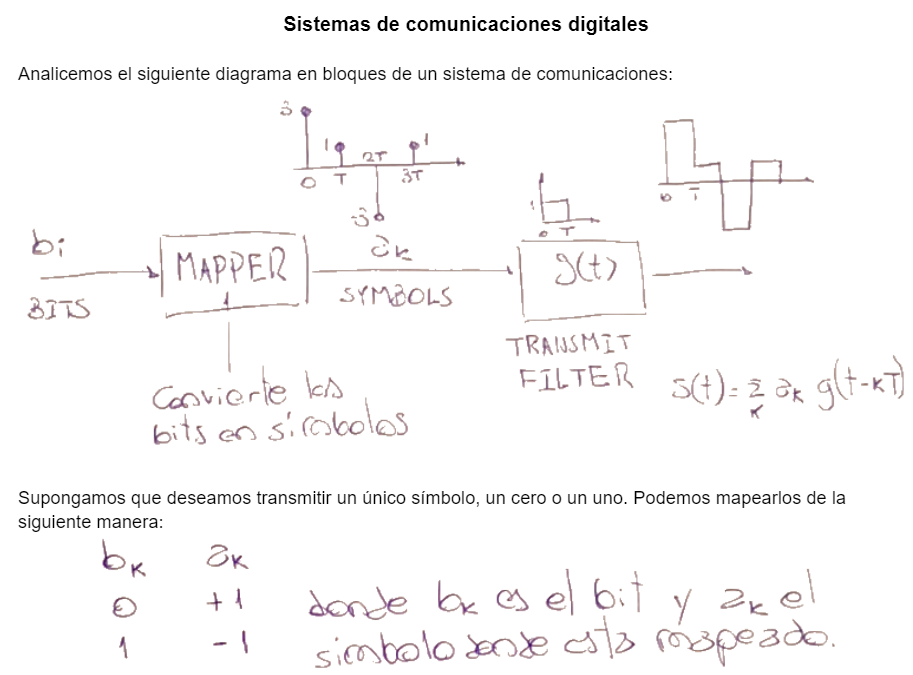
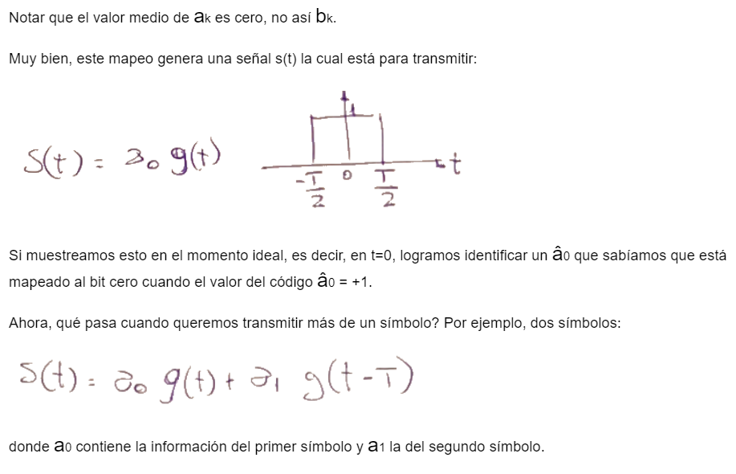
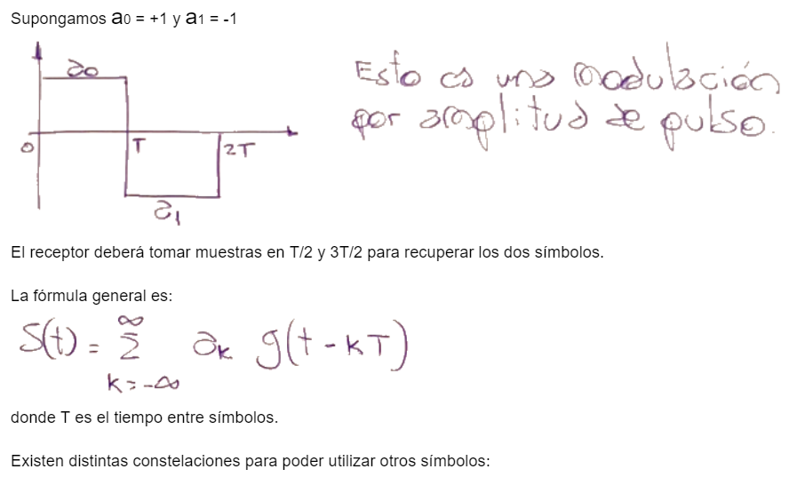
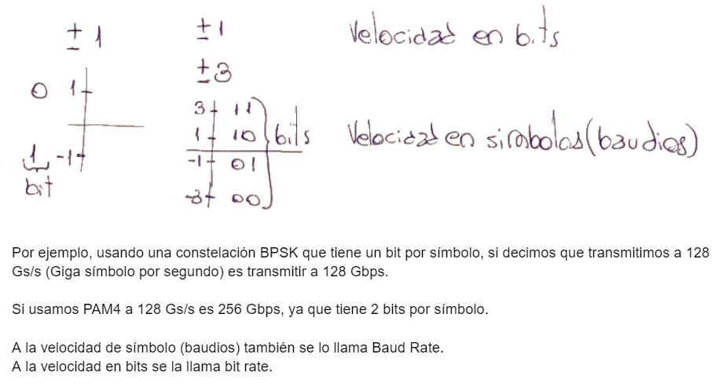
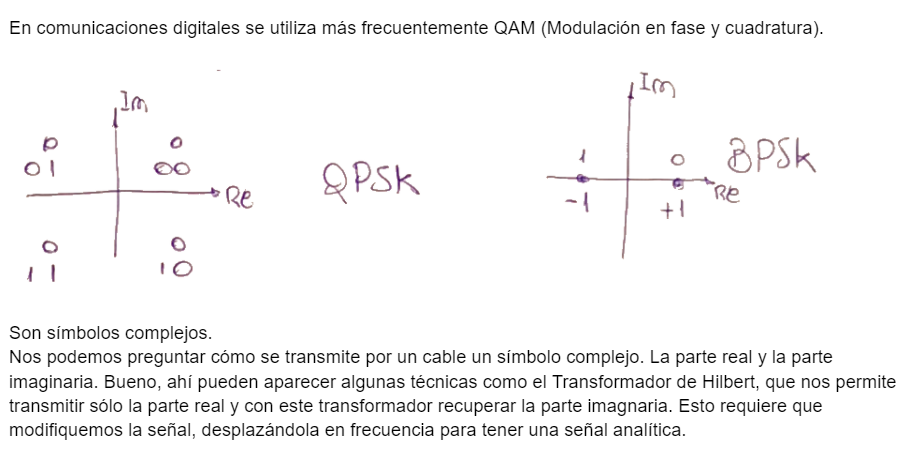
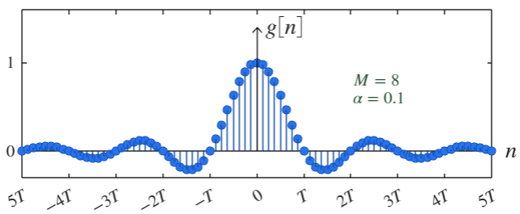

.. -*- coding: utf-8 -*-

.. _rcs_subversion:

Clase 07 - PIII 2025
====================
(Fecha: 27 de agosto)

Simple Moving Average Filter (Media móvil simple)
==================================================

- La ecuación en diferencia para este filtro es la siguiente:

  y[n] = y[n-1] + (1 / W) * (x[n] - x[n-W])

- ``W`` es el tamaño de la ventana deslizante.
- ``y[n]`` es la salida actual.
- ``y[n-1]`` es la salida anterior.
- ``x[n]`` es la entrada actual.
- ``x[n-W]`` es la entrada que sale de la ventana.

- Este filtro actúa como un filtro pasabajos, suavizando la señal al promediar un número fijo de muestras y atenuar los cambios rápidos.

Ejercicio 13
============

- implementar este filtro con distintos tamaños de ventana.
- Comparar con el Media móvil exponencial
- Realizar un análisis del espectro de frecuencias.
- Plotear la señal original y la filtrada superpuestas para notar el suavizado.

Tonos de Shepard
================

- Acústica, psicoacústica, y procesamiento de señales. 
- Los Tonos de Shepard son una serie de tonos puros que, cuando se reproducen en secuencia, crean la ilusión auditiva de un tono que sube o baja infinitamente en altura, a pesar de que en realidad no ocurre un cambio real en la frecuencia.
- Los Tonos de Shepard consisten en varios tonos sinusoidales espaciados por octavas. Al variar la amplitud de estos tonos de forma que los extremos (frecuencias más bajas y más altas) se atenúan, se crea una ilusión de un tono que parece subir o bajar infinitamente.
- Psicoacústica: La percepción de los Tonos de Shepard explota una característica de nuestro sistema auditivo: la capacidad de identificar tonos en diferentes rangos de frecuencia, pero sin una clara distinción cuando los tonos están compuestos de múltiples frecuencias.

.. code-block:: python

	import numpy as np
	import matplotlib.pyplot as plt
	from IPython.display import Audio

	def generate_shepard_tone(base_freq, num_tones, duration, sample_rate):
	    t = np.linspace(0, duration, int(sample_rate * duration), endpoint=False)
	    tone = np.zeros_like(t)

	    for i in range(num_tones):
	        freq = base_freq * (2 ** i)
	        amplitude = np.sin(np.pi * i / num_tones) ** 2
	        tone += amplitude * np.sin(2 * np.pi * freq * t)

	    return tone

	# Parámetros
	base_freq = 440  # Frecuencia base en Hz (Nota La)
	num_tones = 6    # Número de tonos superpuestos
	duration = 0.5   # Duración de cada tono en segundos
	sample_rate = 44100  # Tasa de muestreo

	# Generar el tono de Shepard
	shepard_tone = generate_shepard_tone(base_freq, num_tones, duration, sample_rate)

	# Reproducir el tono generado
	Audio(shepard_tone, rate=sample_rate)

	def generate_shepard_scale(base_freq, num_tones, duration, sample_rate, steps):
	    scale = []
	    for step in range(steps):
	        tone = generate_shepard_tone(base_freq * (2 ** (step / steps)), num_tones, duration, sample_rate)
	        scale.append(tone)
	    return np.concatenate(scale)

	# Parámetros adicionales
	steps = 100  # Número de pasos en la escala (equivalente a una octava)

	# Generar la escala de Shepard
	shepard_scale = generate_shepard_scale(base_freq, num_tones, duration, sample_rate, steps)

	# Reproducir la escala
	Audio(shepard_scale, rate=sample_rate)

Ejercicio 14
============

- Modificar parámetros como num_tones, base_freq, y steps para observar cómo cambia la percepción.
- ¿Qué ocurre si cambia la tasa de muestreo o la duración de cada tono?
- Implementar una versión que genera una escala descendente.
- Graficar señal, espectro de frecuencias y espectograma.

Pulsación
=========

- La pulsación, o "beats", es un fenómeno acústico que ocurre cuando dos tonos de frecuencias diferentes se reproducen simultáneamente. 
- Se manifiesta como una oscilación en la amplitud de la onda resultante, que se percibe como un sonido que fluctúa en volumen.

.. code-block:: python

	import numpy as np
	import matplotlib.pyplot as plt
	from IPython.display import Audio

	def generate_beats(freq1, freq2, duration, sample_rate):
	    t = np.linspace(0, duration, int(sample_rate * duration), endpoint=False)
	    signal1 = np.cos(2 * np.pi * freq1 * t)
	    signal2 = np.cos(2 * np.pi * freq2 * t)
	    beats = signal1 + signal2
	    return t, beats

	# Parámetros
	freq1 = 440  # Frecuencia del primer tono en Hz (Nota La)
	freq2 = 442  # Frecuencia del segundo tono en Hz
	duration = 5.0  # Duración de la señal en segundos
	sample_rate = 44100  # Tasa de muestreo

	# Generar la señal de beats
	t, beats_signal = generate_beats(freq1, freq2, duration, sample_rate)

	# Visualizar la señal de beats
	plt.plot(t[:1000], beats_signal[:1000])  # Visualización de un pequeño fragmento de la señal
	plt.title('Señal de Beats')
	plt.xlabel('Tiempo [s]')
	plt.ylabel('Amplitud')
	plt.show()

	# Reproducir la señal de beats
	Audio(beats_signal, rate=sample_rate)

Ejercicio 15
============

- ¿Cuál es la fórmula para calcular la frecuencia de oscilación?
- ¿Cómo se perciben las pulsaciones cuando las frecuencias están muy cerca en comparación a cuando están más alejadas?
- ¿Qué pasa si se multiplican? Es modulación AM? Con portadora, sin portadora, o qué? Analizarlo.

.. figure:: images/sistema_comunicaciones_parte6.png

`Filtro transmisor (ipynb) <https://colab.research.google.com/drive/1TTM3s-seiJ2C7BfwcByFCVduOuGDdTeF?usp=sharing>`_ 
================================

- Probar el siguiente ejemplo:

.. code-block:: python

	import numpy as np
	import matplotlib.pyplot as plt
	plt.style.use( 'seaborn-darkgrid' )

	# ====================
	#  Generación de g[n] 
	# ====================

	fB = 32e9    # Velocidad de simbolos (baud rate)
	# Es la frecuencia de los simbolos, 32 GBaudios

	T = 1 / fB   # Tiempo entre símbolos
	M = 8        # Factor de sobremuestreo
	fs = fB * M  # Sample rate

	alpha = 0.1  # Factor de roll-off
	L = 20       # ( 2 * L * M + 1 ) es el largo del filtro sobremuestreado

	t = np.arange( -L, L, 1 / M ) * T

	gn = np.sinc( t / T ) * np.cos( np.pi * alpha * t / T ) / ( 1 - 4 * alpha**2 * t**2 / T**2 )

	fig, axs = plt.subplots( nrows = 2, ncols = 1 )
	fig.set_figwidth( 15 )
	fig.set_figheight( 10 )

	axs[ 0 ].stem( t, gn, use_line_collection = True )
	axs[ 0 ].set_title( 'Gráfico 1' )
	axs[ 0 ].set_xlabel( 'n' )
	axs[ 0 ].set_ylabel( 'gn' )

	axs[ 1 ].stem( t[ 100 : 150 ], gn[ 100 : 150 ], use_line_collection = True )
	axs[ 1 ].set_title( 'Gráfico 2' )
	axs[ 1 ].set_xlabel( 'n' )
	axs[ 1 ].set_ylabel( 'gn' )

	plt.show()

Ejercicio 16
============

- Acercar el aspecto a la siguiente gráfica. Es decir, adornar con las leyendas, ejes de coordenadas, etc.

----

--------------------------
Entrega en GitHub
--------------------------
1. Subir códigos y gráficos generados.
2. Usar la carpeta Clase07
3. Documentar en ``README.md`` cada ejercicio.
4. Próxima clase, 20 minutos cada estudiante para presentar oralmente en GitHub los 16 ejercicios.

