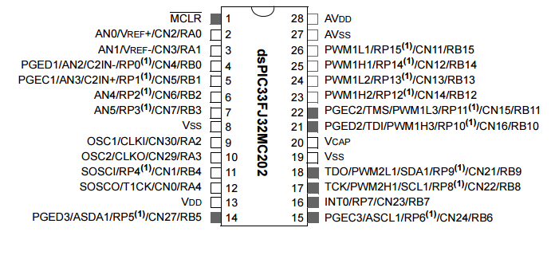

.. -*- coding: utf-8 -*-

.. _rcs_subversion:

Clase 11 - PIII 2025
====================
(Fecha: 29 de septiembre)

Revisión de microcontroladores, placas de desarrollo, programación sobre DSPs
=============================================================================

Familias de microcontroladores Microchip, PIC, DSP, dsPIC
---------------------------------------------------------

*PIC (Peripheral Interface Controller)*
   - Microcontroladores de propósito general.
   - Utilizados en aplicaciones donde se requiere control básico de entradas y salidas.
   - Arquitectura sencilla, adecuada para tareas con sensores, motores y aplicaciones embebidas.
   - Capacidad limitada en procesamiento.

*DSP (Digital Signal Processor):*
   - Procesadores especializados en el procesamiento rápido de señales digitales.
   - Optimizados para operaciones matemáticas intensivas, como multiplicaciones y sumas en paralelo (MAC - Multiply-Accumulate).
   - Utilizados en aplicaciones de telecomunicaciones, procesamiento de audio y video, reconocimiento de voz, etc.
   - Arquitectura más compleja que un PIC y altamente eficiente para operaciones DSP.

*MCU (MicroController Unit)*
   - Microcontroladores clásicos
   - Las operaciones complejas las realiza en varios ciclos
   
*DSC (Digital Signal Controller)*
   - Híbrido MCU/DSP
   - Controlador digital de señales
   
*dsPIC (Nombre que utiliza Microchip para referirse a sus DSC)*
   - Registros de 16 bits
   - Híbrido entre PIC y DSP.
   - Familias dsPIC30F y dsPIC33F
   - Combina la facilidad de uso y el control de un PIC con las capacidades avanzadas de procesamiento de señales de un DSP.
   - Ideal para aplicaciones embebidas que requieren procesamiento de señales en tiempo real.
   - Utilizado en aplicaciones de telecomunicaciones y audio.
   - Es accesible conseguir los siguientes: dsPIC30F4013 (40 pines), dsPIC30F2010 (28 pines) y dsPIC33FJ32MC202 (28 pines)

.. figure:: images/precio_rendimiento.png

Softwares
---------
- Proteus
- mikroC para dsPIC
- MATLAB

*Proteus*
   - Conjunto de programas para diseño y simulación
   - Desarrollado por Labcenter Electronics (http://www.labcenter.com)
   - Herramientas principales: ISIS y ARES

*ISIS (Intelligent Schematic Input System - Sistema de Enrutado de Esquemas Inteligente)*
   - Permite diseñar el circuito con los componentes.
   - Permite el uso de microcontroladores grabados con nuestro propio programa.
   - Contiene herramientas de medición, fuentes de alimentación y generadores de señales.
   - Puede simular en tiempo real mediante VSM (Virtual System Modeling -Sistema Virtual de Modelado).

*ARES (Advanced Routing and Editing Software - Software de Edición y Ruteo Avanzado)*
   - Permite ubicar los componentes y rutea automáticamente para obtener el PCB (Printed Circuit Board).
   - Permite ver una visualización 3D de la placa con sus componentes.

*mikroC para dsPIC*
   - Compilador C para dsPIC ( https://www.mikroe.com/mikroc-dspicpic24 )
   - Incluye bibliotecas de programación
   - Desarrollado por MikroElektronika ( https://www.mikroe.com/mikroc/#dspic )
   - MikroElektronika también dispone de placas de desarrollo como la Easy dsPIC que disponemos en el Lab
   
*MATLAB*
   - IDE con un lenguaje de programación propio.
   - Simulación, matrices, algoritmos, GUI, DSP, ...

Arquitectura Harvard vs. Von Neumann
------------------------------------

*Arquitectura Harvard:*
  - Tiene memorias separadas para instrucciones y datos.
  - Permite acceso simultáneo a instrucciones y datos, lo que resulta en mayor velocidad de procesamiento.
  - Común en microcontroladores como los dsPIC y en procesadores DSP.
  - Ventajas: alta velocidad, acceso simultáneo a instrucciones y datos.
  - Desventajas: complejidad en diseño y costo.

*Arquitectura Von Neumann:*
  - Usa una única memoria para almacenar tanto instrucciones como datos.
  - El acceso a la memoria es secuencial, lo que puede ser un cuello de botella para la velocidad de procesamiento.
  - Común en microcontroladores simples, más simples que los PIC16.
  - Ventajas: simplicidad y menor costo.
  - Desventajas: velocidad de procesamiento limitada.

Interrupciones
--------------

- Eventos que hacen que el dsPIC deje de realizar lo que está haciendo y pase a ejecutar otra tarea.
- Las causas pueden ser diferentes (Interrupciones externas, Timers, ADC, UART, etc.).
- 7 niveles de prioridad (1 a 7 a través de los registros IPCx). Con 0 se desactiva la interrupción.
- Permite que una interrupción de mayor prioridad invalide una de menor prioridad que esté en progreso.
- Existe una tabla de vectores de interrupción (IVT) que indica dónde escribir la función que atenderá dicha interrución.
- También hay una tabla alternativa (AIVT) que se usa en situaciones de depuración o pruebas sin necesidad de reprogramar las interrupciones. También puede que un programa esté dividido en aplicaciones: una aplicación en el bootloader y otra aplicación principal. Entonces, una de ellas usa el AIVT y la otra el IVT.
- Cuando una interrupción es atendida, el PC (Program Counter) se carga con la dirección que indica la tabla de vector de interrupción (IVT)

.. figure:: images/ivt.png
   :target: http://ww1.microchip.com/downloads/en/DeviceDoc/70046E.pdf
   
.. figure:: images/ivt_dspic33F.png
   :target: http://ww1.microchip.com/downloads/en/DeviceDoc/70214C.pdf

Registros para configuración
----------------------------
   
- IFS0<15:0>, IFS1<15:0>, IFS2<15:0>
   - Banderas de solicitud de interrupción. (el software debe borrarlo - hay que hacerlo sino sigue levantando la interrupción).

- IEC0<15:0>, IEC1<15:0>, IEC2<15:0>
   - Bits de control de habilitación de interrupción.

- IPC0<15:0>... IPC10<7:0>
   - Prioridades

- INTCON1<15:0>, INTCON2<15:0>
   - Control de interrupciones.
      - INTCON1 contiene el control y los indicadores de estado. 
      - INTCON2 controla la señal de petición de interrupción externa y el uso de la tabla AIVT.

.. figure:: images/registro_interrupciones.png
   :target: http://ww1.microchip.com/downloads/en/devicedoc/70138c.pdf

.. figure:: images/manejo_osciladores.png

.. figure:: images/osciladores.png
   :target: http://ww1.microchip.com/downloads/en/DeviceDoc/70046E.pdf

.. figure:: images/calculo_fcy.png

Pinout de algunos dsPIC
-----------------------

.. figure:: images/dspic30f4013.png
   :target: http://ww1.microchip.com/downloads/en/devicedoc/70138c.pdf

.. figure:: images/manejo_timers.png

.. figure:: images/map_timer23.png
   :target: http://ww1.microchip.com/downloads/en/devicedoc/70138c.pdf

Ejercicio 18: Generador de tono variable con dsPIC y DAC R2R
============================================================

Configurar un dsPIC para leer un voltaje analógico a través de un ADC, y utilizar esa lectura para generar una señal de frecuencia variable. La señal será producida en 10 pines digitales conectados a un DAC R2R, que convertirá la señal digital en una salida analógica.

Descripción
-----------

1. **Configuración del ADC:**

   - Configura un canal del ADC para leer un voltaje aplicado a un pin analógico del dsPIC. El rango de voltaje es de 1 a 3V.

   - Configura el ADC para que funcione en modo de conversión continua y para que convierta el voltaje con una resolución de 12 bits.

2. **Configuración de los pines digitales:**

   - Configura 10 pines digitales del dsPIC como salidas. Estos pines se conectarán a un DAC R2R construido con resistencias.

   - El DAC R2R debe estar diseñado para convertir la señal digital de 10 bits en una señal analógica.

3. **Generación de la señal de frecuencia variable:**

   - Usa la lectura del ADC para ajustar la frecuencia de un tono. La señal debe ser generada en función de la lectura del ADC y salida a través de los 10 pines digitales configurados.

   - La frecuencia del tono debe variar en función del voltaje medido por el ADC, con un rango de frecuencia entre 50 Hz y 500 Hz.

4. **Salida a DAC R2R:**

   - Conecta los 10 pines digitales al DAC R2R, que estará armado con resistencias para convertir la señal digital en una señal analógica.
   
   - La salida analógica del DAC R2R debe ser observable con un osciloscopio.

----

.. figure:: images/ejemplo_conexion_micro.png

.. code-block::

	void detectarIntT1() org 0x001a  {
	    LATBbits.LATB0 = !LATBbits.LATB0;
	    IFS0bits.T1IF = 0;  // Borramos la bandera de interrupción T1
	}

	void main()  {
	    TRISBbits.TRISB0 = 0;
	    LATBbits.LATB0 = 0;

	    // Modo de operación Timer1
	    T1CON = 0x0000;

	    // Modo operación Timer1: reloj interno, escala 1:1, empieza cuenta en 0
	    TMR1 = 0;

	    // Cuenta 500 ciclos
	    PR1 = 500;

	    // Interrupciones Timer1, borra Bandera de interrupción
	    IFS0bits.T1IF = 0;

	    // Habilita interrupción
	    IEC0bits.T1IE = 1;

	    // Arranca Timer1
	    T1CONbits.TON = 1;

	    while( 1 )
	       asm nop;
	}

