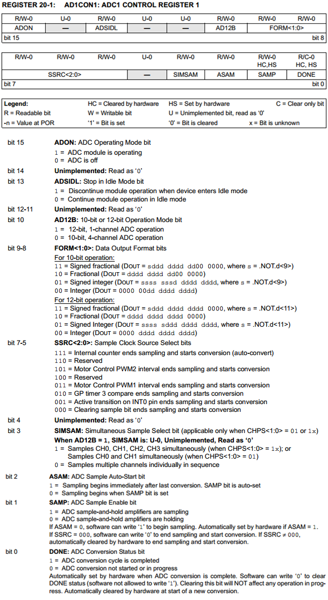
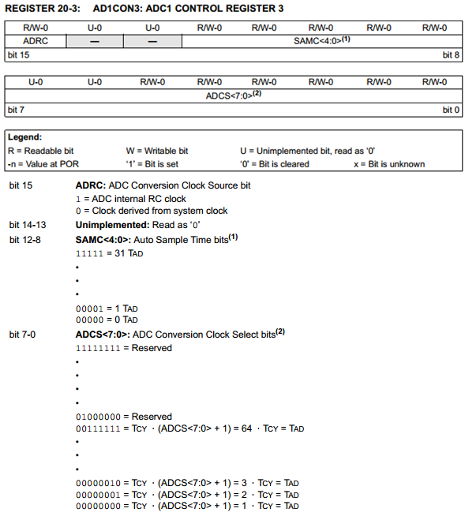

.. -*- coding: utf-8 -*-

.. _rcs_subversion:

Clase 13 - PIII 2025
====================
(Fecha: 8 de octubre)

Conversor AD
============	

- Lleva a cabo la digitalización de las señales continuas externas. 
- En la familia dsPIC30F se puede configurar para 10 bits y 12 bits.
- Hay dos entradas analógicas para establecer una tensión de referencia externa: AVDD y AVSS (Vref+ y Vref-)
- AVDD y AVSS son las conexiones a la fuente de alimentación para las partes analógicas de los circuitos. Se conectan a VDD y VSS.
- Para controlar el ADC se usan 6 registros de control de 16 bits: 
	- ADCON1
	- ADCON2
	- ADCON3 sirve para seleccionar el modo del ADC
	- ADCHS para seleccionar las entradas analógicas
	- ADPCFG para seleccionar el pin utilizado como entrada analógica y el pin usado como pin de I/O
	- ADCSSL para seleccionar las entradas analógicas que serán escaneadas

- La conversión se guarda en un buffer de sólo lectura ADBUF0 a ADBUFF (16 palabras de 12 bits)

**Conversor AD de 12 bits**

.. figure:: images/adc.png

**Una secuencia de conversión**

- El proceso de adquisición de muestras se inicia activando el bit SAMP (este bit está en ADCON1)
- Cuando el tiempo de conversión es completada, el resultado se carga en el buffer ADBUF0 a ADBUFF. 
- Al término de la conversión, el bit DONE (que está en ADCON1) y la bandera de interrupción se setean luego del número de muestras definidas por los bits de control SMPI (este bit está en ADCON2)

**Pasos para realizar una conversión AD:**

- Configurar el módulo AD
	- Configurar los pines como entradas analógicas, referencias de voltaje, y los pines digitales de I/O
	- Seleccionar un canal de entrada del convertidor AD
	- Seleccionar un reloj de conversión AD
	- Seleccionar una fuente de trigger (disparo)
	- Activar el módulo AD

- Iniciar el muestreo
- Esperar el tiempo de adquisición de muestras
- Fin de adquisición, inicia la conversión
- Esperar que se complete la conversión con el bit DONE
- Leer el buffer
	

Registros
=========

.. figure:: images/registro_adc_todo.png
   :target: http://ww1.microchip.com/downloads/en/devicedoc/70138c.pdf

	        
.. figure:: images/registro_adc2.png
   :target: http://ww1.microchip.com/downloads/en/DeviceDoc/70046E.pdf
			

			
.. figure:: images/registro_adc4.png
   :target: http://ww1.microchip.com/downloads/en/DeviceDoc/70046E.pdf

.. figure:: images/registro_adc6.png
   :target: http://ww1.microchip.com/downloads/en/DeviceDoc/70046E.pdf

Ejemplo: ADC controlando los momentos de muestreo con señal cuadrada externa
========

- Para dsPIC33FJ32MC202
- Con flanco descendente de la señal cuadrada en el pin INT0
- Cristal de 10MHz
- ADC de 10 bits
- Entrada analógica en AN0

.. code-block::

	void config_adc()  {
	    ADPCFG = 0xFFFE; // Elije la entrada analogica a convertir en este caso AN0.
	    // Con cero se indica entrada analogica y con 1 sigue siendo entrada digital.

	    AD1CON1bits.ADON = 0;  // ADC apagado por ahora
	    AD1CON1bits.AD12B = 0;  // ADC de 10 bits
	    AD1CON1bits.FORM = 0b00;  // Formato de salida entero

	    // Para tomar muestras en forma manual. Porque lo vamos a controlar con senal externa en INT0
	    AD1CON1bits.SSRC = 0b000;

	    // Adquiere muestra cuando el SAMP se pone en 1. SAMP lo controlamos desde INT0
	    AD1CON1bits.ASAM = 0;

	    AD1CON2bits.VCFG = 0b000;  // Referencia con AVdd y AVss
	    AD1CON2bits.SMPI = 0b0000;  // Lanza interrupción luego de tomar n muestras.
	    // Con SMPI=0b0000 -> 1 muestra ; Con SMPI=0b0001 -> 2 muestras ; SMPI=0b0010 -> 3 ; etc.

	    // AD1CON3 no se usa ya que usamos muestreo manual

	    // Muestreo la entrada analogica AN0 contra el nivel de AVss (AN0 es S/H+ y AVss es S/H-)
	    AD1CHS0 = 0b0000;
	}

	void config_int0()  {
	    INTCON2bits.INT0EP = 1;  // 0 para Ascendente y 1 para Descendente
	}

	void config_ports()  {

	    TRISAbits.TRISA0 = 1;  // Entrada analogica para muestrear / AN0

	    // Elegimos los puertos RB0-RB6 y RB8-RB10
	    TRISBbits.TRISB0 = 0;  // Menos significativo
	    TRISBbits.TRISB1 = 0;
	    TRISBbits.TRISB2 = 0;
	    TRISBbits.TRISB3 = 0;
	    TRISBbits.TRISB4 = 0;
	    TRISBbits.TRISB5 = 0;
	    TRISBbits.TRISB6 = 0;
	    TRISBbits.TRISB8 = 0;
	    TRISBbits.TRISB9 = 0;
	    TRISBbits.TRISB10 = 0;  // Mas significativo

	    TRISBbits.TRISB7 = 1;  // Es el pin de la INT0

	    TRISBbits.TRISB11 = 0;  // Para debug ADC
	    TRISBbits.TRISB12 = 0;  // Para debug INT0
	}

	void detect_int0() org 0x0014  {
	    IFS0bits.INT0IF=0;  // Borramos la bandera de interrupción INT0

	    LATBbits.LATB12 = !LATBbits.LATB12;  // Para debug de la interrupcion INT0

	    AD1CON1bits.DONE = 0;  // Antes de pedir una muestra ponemos en cero
	    AD1CON1bits.SAMP = 1;  // Pedimos una muestra

	    asm nop;  // Tiempo que debemos esperar para que tome una muestra

	    AD1CON1bits.SAMP = 0;  // Pedimos que retenga la muestra
	}

	void detect_adc() org 0x002e  {

	    IFS0bits.AD1IF = 0; // Borramos el flag de interrupciones del ADC

	    LATBbits.LATB11 = !LATBbits.LATB11;  // Para debug de la interrupcion ADC

	    // Almacenamos los 8 bits más significativos
	    LATBbits.LATB0 = ADCBUF0.B0;
	    LATBbits.LATB1 = ADCBUF0.B1;
	    LATBbits.LATB2 = ADCBUF0.B2;
	    LATBbits.LATB3 = ADCBUF0.B3;
	    LATBbits.LATB4 = ADCBUF0.B4;
	    LATBbits.LATB5 = ADCBUF0.B5;
	    LATBbits.LATB6 = ADCBUF0.B6;
	    LATBbits.LATB8 = ADCBUF0.B7;
	    LATBbits.LATB9 = ADCBUF0.B8;
	    LATBbits.LATB10 = ADCBUF0.B9;
	}

	int main()  {
	    config_ports();
	    config_int0();
	    config_adc();

	    IEC0bits.INT0IE = 1;  // Habilitamos la interrupcion INT0

	    IEC0bits.AD1IE = 1;  // Habilitamos interrupción del ADC

	    AD1CON1bits.ADON = 1;  // Encendemos el ADC

	    while(1)  {  }

	    return 0;
	}

ADC controlando los momentos de muestreo con el Timer2	
======================================================

.. figure:: images/ejemplo_adc1.png

.. figure:: images/ejemplo_adc2.png

**Código fuente**

.. code-block::

	void config_adc()  {
	    ADPCFG = 0xFFFE; // Elije la entrada analógica a convertir en este caso AN0.
	    // Con cero se indica entrada analógica y con 1 sigue siendo entrada digital.

	    ADCON1bits.ADON = 0;  // ADC Apagado por ahora
	    ADCON1bits.ADSIDL = 1;  // No trabaja en modo idle
	    ADCON1bits.FORM = 0b00;  // Formato de salida entero
	    // Para tomar muestras en forma manual. Porque lo vamos a controlar con timer2
	    ADCON1bits.SSRC = 0b000;  
	    // Adquiere muestra cuando el SAMP se pone en 1. SAMP lo controlamos desde el Timer2.
	    ADCON1bits.ASAM = 0;  

	    ADCON2bits.VCFG = 0b000;  // Referencia con AVdd y AVss
	    ADCON2bits.SMPI = 0b0000;  // Lanza interrupción luego de tomar n muestras.
	    // Con SMPI=0b0 -> 1 muestra ; Con SMPI=0b1 -> 2 muestras ; Con SMPI=0b10 -> 3 muestras ; etc.

	    // AD1CON3 no se usa ya que tenemos deshabilitado el cálculo del muestreo con ADCS etc.

	    // Muestreo la entrada analógica AN0 contra el nivel de AVss (AN0 es S/H+ y AVss es S/H-)
	    ADCHS = 0b0000;  

	    ADCON1bits.ADON = 1;// Habilitamos el A/D
	}

	void detectarIntT2() org 0x0020  {
	    IFS0bits.T2IF=0;  // Borramos la bandera de interrupción T2

	    ADCON1bits.DONE = 0;  // Antes de pedir una muestra ponemos en cero
	    ADCON1bits.SAMP = 1;  // Pedimos una muestra

	    asm nop;

	    ADCON1bits.SAMP = 0;  // Pedimos que retenga la muestra
	}

	void interrupcionADC() org 0x002a  {

	    LATCbits.LATC14 = !LATCbits.LATC14;  // Para debug y ver si ingresa acá

	    // Almacenamos los 8 bits más significativos
	    LATBbits.LATB1 = ADCBUF0.B2;
	    LATBbits.LATB2 = ADCBUF0.B3;
	    LATBbits.LATB3 = ADCBUF0.B4;
	    LATBbits.LATB4 = ADCBUF0.B5;
	    LATBbits.LATB5 = ADCBUF0.B6;
	    LATEbits.LATE0 = ADCBUF0.B7;
	    LATEbits.LATE1 = ADCBUF0.B8;
	    LATEbits.LATE2 = ADCBUF0.B9;

	    IFS0bits.ADIF = 0; // Borramos el flag de interrupciones
	}

	int main()  {

	    // Elegimos el puerto B y E para la salida digital.
	    // Ya que no alcanzan los pines para que todo salga por un único puerto
	    TRISB = 0;
	    TRISE = 0;

	    TRISCbits.TRISC14 = 0;  // Para debug nomás

	    // Configuramos el módulo ADC
	    config_adc();

	    IEC0bits.ADIE = 1;  // Habilitamos interrupción del A/D

	    // Modo de operación Timer2 - Con el clock interno
	    T2CON = 0x0000;

	    // Prescaler para timer
	    // 00 -> 1:1 - 01 -> 1:8 - 10 -> 1:64 - 11 -> 1:256
	    T2CONbits.TCKPS = 0b01;

	    TMR2 = 0;
	    PR2 = 7;

	    IEC0bits.T2IE = 1;  // Habilita interrupciones timer2

	    // Arrancamos el timer2
	    T2CONbits.TON = 1;

	    while( 1 )  {  }

	    return 0;
	}

